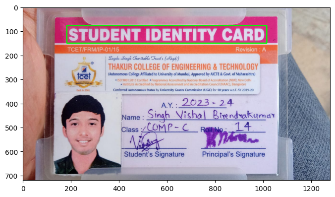

# Text Detection with EasyOCR and OpenCV

This project demonstrates how to use the EasyOCR library for text recognition combined with OpenCV for visualizing detected text in images. The provided code reads text from an image and highlights the detected text area using bounding boxes.

## Features

- **Text Detection:** Uses EasyOCR to extract text from images.
- **Visualization:** Highlights the detected text area on the image with bounding boxes using OpenCV.
- **Simple Integration:** Easily adaptable for various image processing and OCR tasks.

## Prerequisites

Make sure you have the following Python libraries installed:
- `easyocr`
- `matplotlib`
- `opencv-python-headless` (OpenCV)
- `IPython` (for displaying images in notebooks)

You can install these libraries using pip:

```bash
pip install easyocr matplotlib opencv-python-headless
```

## Usage

1. **Install Dependencies:**

   ```bash
   pip install easyocr matplotlib opencv-python-headless
   ```

2. **Prepare Your Image:**
   - Place your image file in the same directory as the notebook or specify the path to the image file.

3. **Run the Code:**

   ```python
   import matplotlib.pyplot as plt
   import cv2
   import easyocr
   from pylab import rcParams
   from IPython.display import Image

   # Set figure size for displaying images
   rcParams['figure.figsize'] = 8, 16

   # Initialize EasyOCR Reader
   reader = easyocr.Reader(['en'])

   # Load and display the image
   Image("identity.jpg")

   # Read text from the image
   output = reader.readtext('identity.jpg')

   # Get the bounding box coordinates of the first detected text
   cord = output[0][0]
   x_min, y_min = [int(min(idx)) for idx in zip(*cord)]
   x_max, y_max = [int(max(idx)) for idx in zip(*cord)]

   # Read image using OpenCV
   image = cv2.imread('identity.jpg')
   
   # Draw bounding box around detected text
   cv2.rectangle(image, (x_min, y_min), (x_max, y_max), (0, 255, 255), 2)
   
   # Display the image with bounding box
   plt.imshow(cv2.cvtColor(image, cv2.COLOR_BGR2RGB))
   plt.axis('off')  # Hide axes
   plt.show()
   ```

## How It Works

1. **Text Detection:**
   - EasyOCR detects text in the specified image file (`identity.jpg`).

2. **Bounding Box Drawing:**
   - The detected text areas are highlighted using bounding boxes drawn by OpenCV.

3. **Display Results:**
   - The resulting image with bounding boxes is displayed using Matplotlib.

## Example



*Note: Replace `example_image.png` with the output image from running the code.*

## Contribution

Feel free to contribute to this project by:
- Submitting issues
- Creating pull requests
- Providing feedback

## License

This project is licensed under the MIT License - see the [LICENSE](LICENSE) file for details.

